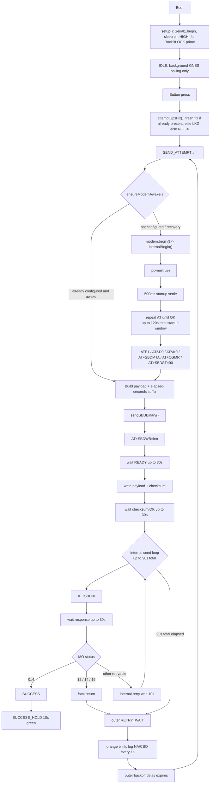

# KB2040 RockBLOCK Iridium Beacon

This repository contains the current KB2040 + RockBLOCK 9603 beacon firmware, along with a simplified serial-controlled base-case firmware for direct modem testing.

## Main Firmware

- Main firmware entry point: `src/main.cpp`
- Target board: Adafruit KB2040
- Primary PlatformIO environment: `adafruit_kb2040`

## Upload The Main Firmware

Build and upload `src/main.cpp` to the KB2040:

```bash
pio run -e adafruit_kb2040 -t upload
```

Open the serial monitor for the main firmware:

```bash
pio device monitor -e adafruit_kb2040
```

If PlatformIO does not auto-detect the board, put the KB2040 into BOOTSEL mode and specify the upload port explicitly:

```bash
pio run -e adafruit_kb2040 -t upload --upload-port /dev/cu.usbmodemXXXX
```

## Upload The Base-Case Firmware

Build and upload the serial-command base case:

```bash
pio run -e adafruit_kb2040_basecase -t upload
```

Open the serial monitor for the base-case firmware:

```bash
pio device monitor -e adafruit_kb2040_basecase
```

## Main Send Flow



## Notes

- The main firmware appends the elapsed whole-second send timer to the transmitted payload on each outer send attempt.
- GNSS metadata is attached without blocking the first send when no fresh fix is available.
- The base-case environment exists to isolate modem behavior from the full button/GNSS state machine.
